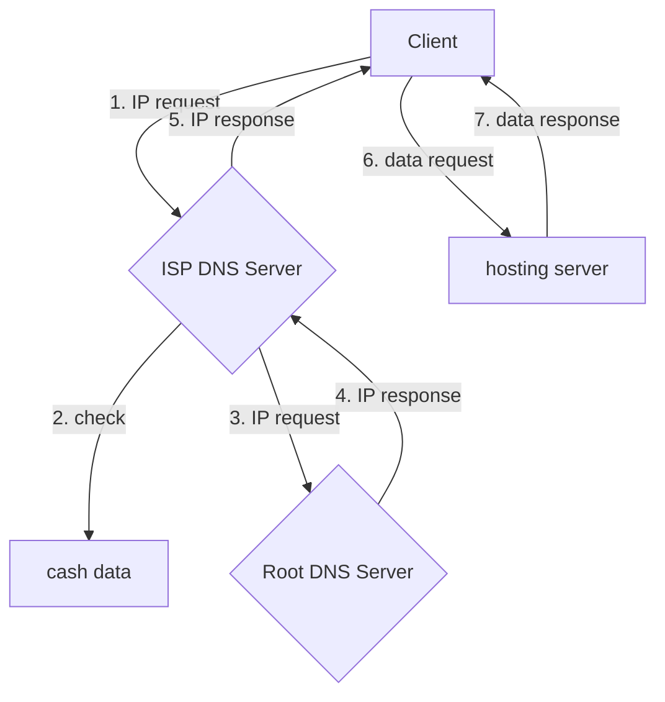

이전 포스트 <a href="/dns/2023/10/28/DNS-def.html">DNS</a>를 먼저 보시는게 좋습니다.

우리는 주소창에 www.google.com 이라고 입력하고 구글에 접속하게 되는데 이는 우리 컴퓨터의 hosts 파일에 존재하지 않는다. 그렇다면 어느 hosts 파일에 해당 주소의 IP값이 존재할까?

당연하게도 컴퓨터의 hosts 파일이나 hosts 파일이 존재하는 라우터에 모든 DNS에 대한 주소값을 가지고 있지 않다.

그렇기에 우리에게 인터넷을 제공하는 제공자가 그 답을 던져준다.

### ISP :Internet Service Provider ###
SK브로드밴드, KT, LG U+ 과 같은 인터넷 서비스 제공자는 인터넷을 이용자에게 제공하면서 DNS Server를 운영하게 되고 그 서버에는 hosts 파일에 DNS를 IP주소로 매치시켜 두었듯이 미리 저장해 둔다.

쉽게 말해서, 통신사와 같은 제공자들이 DNS Server를 운영하며 DNS에 대한 처리 방법을 들고 있어 우리가 요청함에 따라 응답한다.

다음은 각 ISP들의 DNS Server IP이다.
* Google
>8.8.8.8
* SK
>210.220.163.82
* KT
>168.126.63.1
* LG
>164.124.107.9

### DNS Server 접속 원리 ###

사용자는 1순위로 자신의 hosts 파일을 열어서 주소창에 입력된 DNS의 IP 주소를 얻어낸다. 자신이 필요한 IP가 들어있지 않으면 ISP DNS Server에 요청함으로써 자신이 필요한 IP 주소를 얻게 된다.

ISP 서버에도 사용자가 원하는 domain name에 대한 IP 주소가 존재하지 않을 경우가 있는데 그럴 때에는 3,4번의 과정에 따라 Root DNS Server에게 IP 요청을 주고 응답받는다. (물론 ISP 서버에 IP주소가 존재하면 생략된다)